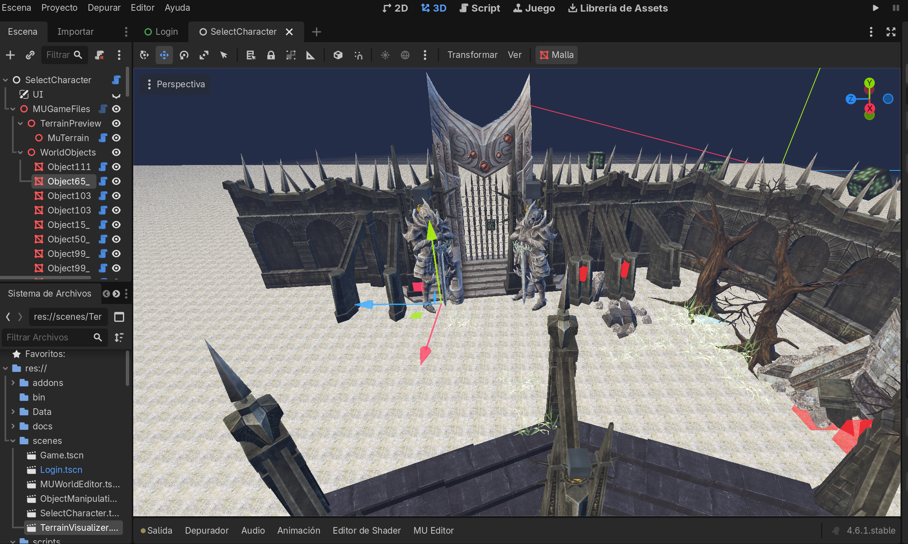

# MU World Editor Plugin

Plugin de Godot para cargar terrenos y objetos de MU Online como nodos editables dentro del editor 3D.

Creditos: `@jassonlazo`



## Funcionalidades

- Carga el terreno de un mundo MU dentro del viewport 3D del editor.
- Importa objetos desde `EncTerrain*.obj` como nodos editables.
- Permite mover, rotar, escalar y duplicar objetos con las herramientas normales de Godot.
- Exporta el layout actual a un archivo `EncTerrain*.edited.obj`.

## Estructura

El plugin se instala en:

```text
addons/mu_world_editor
```

Archivos principales:

- `plugin.gd`
- `mu_world_editor.gd`
- `mu_world_editor_dock.gd`
- `mu_object_codec.gd`
- `runtime/mu_terrain_runtime.gd`
- `runtime/bmd_instance_runtime.gd`
- `runtime/terrain_bmd_loader_runtime.gd`
- `runtime/bmd_decryption_runtime.gd`
- `runtime/mu_terrain.gdshader`

## Uso

1. Copia la carpeta `addons/mu_world_editor` dentro de tu proyecto Godot.
2. Copia dentro de tu proyecto una carpeta `Data` con los archivos de MU que quieras abrir.
3. Activa el plugin desde `Project > Project Settings > Plugins`.
4. Abre una escena 3D y usa el panel `MU Editor`.
5. El plugin leera `res://Data/World*` y `res://Data/Object*` automaticamente.
6. Guarda el resultado en un archivo `EncTerrain*.edited.obj`.

## Notas

- El addon incluye su `GDExtension` para Windows y sus scripts runtime dentro de `addons/mu_world_editor`, para que no dependa de `res://scripts` ni de un `bin/` externo.
- Para usarlo, el usuario solo necesita importar su propia carpeta `Data` dentro del proyecto Godot.
- El plugin no sobreescribe el archivo `EncTerrain*.obj` original por defecto.
- Si falta un archivo `.bmd`, crea un placeholder para mantener el flujo de edicion.
- Los objetos importados quedan organizados dentro del nodo `WorldObjects`.
